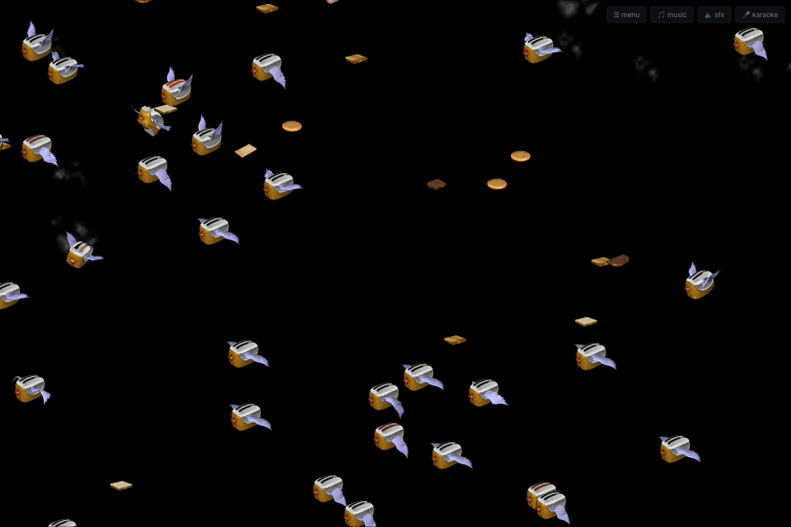
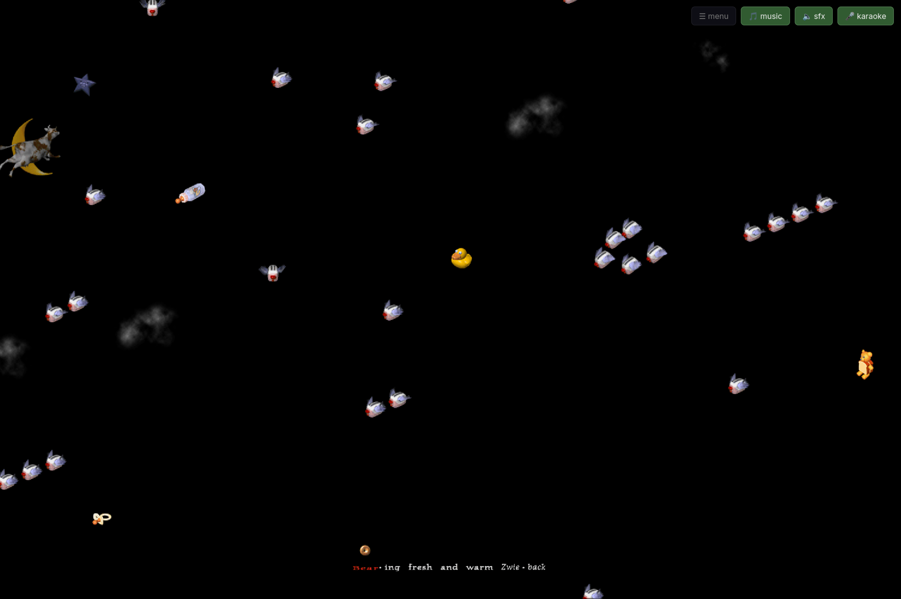
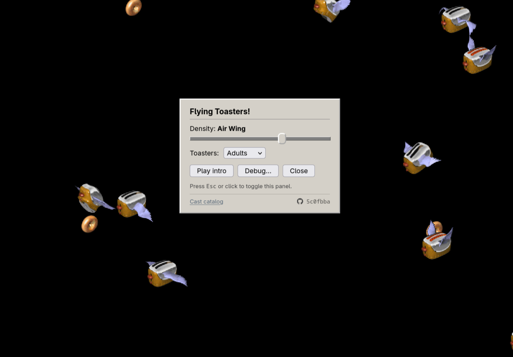

# Flying Toasters!

[Live](https://backslasher.github.io/flying-toasters-reverse-engineered/)

A highly faithful reconstruction of the 1996 "Flying Toasters!" — the final and most elaborate version of the [After Dark Flying Toasters](https://en.wikipedia.org/wiki/After_Dark_%28software%29#Flying_Toasters) screensaver — in HTML + CSS + JavaScript.  
Logic, sprites, and audio extracted from the 1996 abandonware binary.  
Includes music, karaoke, and SFX.  
Baby mode included.  

All of the work was done by Claude (mostly Fable), with me prodding it.

## Why
I felt very nostalgic and was missing a good way to experience the same feeling again - music, different gags, the lot.

## Gallery

Regular  
  

Babies  
  

Config  
  

## License
The code is [AGPL-3.0](LICENSE). The extracted artwork, choreography data, music, and sounds remain the property of the After Dark rightsholders and are included for preservation only — see [NOTICE](NOTICE).
